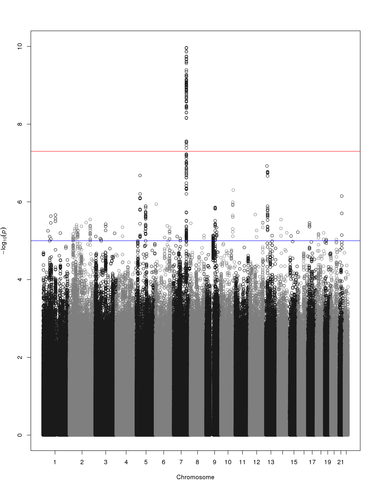
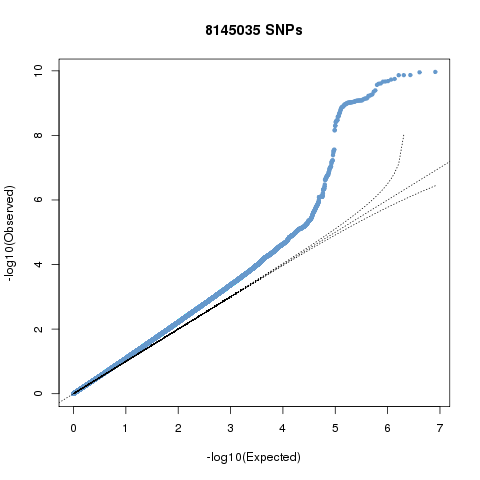

.. |date| date::

==============
GEMMA PIPELINE
==============

:Author: Vince Forgetta
:Contact: <vincenzo.forgetta@mail.mcgill.ca>
:Last modified: |date|

SYNOPSIS
--------

Analyze imputed genotypes using GEMMA. Includes program to convert genotypes from SNPTEST to BIMBAM. The pipeline uses Grid Engine to parallelize computation.

REQUIREMENTS
------------

* Linux
* Grid Engine
* Python with the multiprocessing module.
* Perl
* R statistical package with gap library.
* Plink, gtool are optional, and used to build initial relatedness matrix.

INPUT FILES
-----------

In addition to the information below, further details can also be obtained from the GEMMA manual.

The following files are required by the pipeline:

Phenotype File
~~~~~~~~~~~~~~

A phenotype file consists of one value per line for every individual::

 phenotype value1
 phenotype value2
 phenotype value3
 phenotype value4
 ...
 phenotype valueN

.. important:: The order of the individuals MUST be the same as they occur in the genotype file and relatedness matrix.

More than one row can be present, indicating multiple phenotype values per individual. Covariates can also be given in a separate file.

Please refer to the GEMMA manual for more detail on how to create a phenotype and covariate file.

You can then specify which phenotype to use or the covariate file using the "-g" option of the pipeline (see STEP 4 of the pipeline below).

Also, to convert a GenABEL formatted phenotype file to GEMMA format you can use the following script::

 bin/genabelPheno2gemmaPheno.py 

See the contents of this script for further details.

SNP Genotype files
~~~~~~~~~~~~~~~~~~

The pipeline accepts as input genotype data in SNPTEST or IMPUTE format (i.e, \*.gen files). See the http://www.stats.ox.ac.uk/~marchini/software/gwas/file_format.html for further information regarding this file format.

SNP Informativity File (optional)
~~~~~~~~~~~~~~~~~~~~~~~~~~~~~~~~~

This file is used to filter SNPs for informativity after executing GEMMA. An excerpt from the file is::

 10-100000625 10 100000625
 10-100000645 10 100000645
 10-100001867 10 100001867
 10-100003242 10 100003242
 10-100003302 10 100003302
 10-100003304 10 100003304
 10-100003785 10 100003785
 10-100004360 10 100004360

Where columns are <snp_name> <chrom> <pos>.

PROGRAMS
--------

The programs within the bin directory and their purpose are:

Data preparation
~~~~~~~~~~~~~~~~

* gen2bimbam_batch.bash -- Script to batch convert using Grid Engine one or more SNPTEST files to BIMBAM mean genotype format. Uses gen2bimbam.bash.
* gen2bimbam.bash -- Wrapper script to convert one SNPTEST file to BIMBAM mean genotype format. Uses gen2bimbam.py.
* gen2bimbam.py -- Script to convert one SNPTEST file to BIMBAM mean genotype format.
* gen2annotate.bash -- Generate a BIMBAM SNP information file from SNPTEST genotype file.

Data Analysis
~~~~~~~~~~~~~

* run_pipeline.bash -- Script to execute the GEMMA analysis pipeline.
* gemma -- The GEMMA binary.
* clean.bash -- Filter SNP results from GEMMA (\*.assoc.txt) for INFO, BETA, and SE.
* graphs.bash -- Script to generate graphs (MH plot, QQ plot) from GEMMA results (\*.assoc.txt) for each input genotype file.
* manhattan.r -- R code to generate a manhattanplot. Used by graphs.bash.
* results.bash -- Script to MERGE all GEMMA results (\*.assoc.txt) and generate graphs.

Miscelaneous programs
~~~~~~~~~~~~~~~~~~~~~

* genabelPheno2gemmaPheno.py -- Script to convert GenABEL phenotype file to GEMMA phenotype file.
* info.bash -- Script to filter SNPs for informativity.

PIPELINE STEPS
--------------

STEP1: Convert Genotypes from SNPTEST to BIMBAM
~~~~~~~~~~~~~~~~~~~~~~~~~~~~~~~~~~~~~~~~~~~~~~~

GEMMA is compatible with BIMBAM mean genotype file format. Genotype data is in SNPTEST or IMPUTE format (i.e., \*.gen files) is convert to BIMBAM format using the following script::

 bin/gen2bimbam_batch.bash ~/archive/t123TUK/imputed/1kGenomes.Phase1/gen.sample/chr/\*.gen

The output mean genotype files are given a ".mgf" file extension.

STEP2: Generate BIMBAM SNP Annoation File
~~~~~~~~~~~~~~~~~~~~~~~~~~~~~~~~~~~~~~~~~

Files containing SNP information, such as rs number, chromosome,  and position, can be optionally supplied to the pipeline. To generate them use the following script to convert SNP information from the SNPTEST genotype files::

 bin/gen2annotate.bash ~/archive/t123TUK/imputed/1kGenomes.Phase1/gen.sample/chr/*.gen

This script assumes the chromosome number is present in the file name in the format chr1.gen, or 1.gen.

The output SNP annotation files are given a ".ann" file extension.

STEP3: Compute Relatedness Matrix
~~~~~~~~~~~~~~~~~~~~~~~~~~~~~~~~~

In addition to a genotype and phenotype data, GEMMA also a relatedness matrix. To generate a relatedness matrix for all the genotype data

Merge all genotype data into one file
:::::::::::::::::::::::::::::::::::::

::
 
  cat <path_to_mgf_files>/\*.mgf > merge.mgf

Create a fake phenotype file
::::::::::::::::::::::::::::

::
  
  NUM_SAMPLES=2500
  for i in $(seq 1 $NUM_SAMPLES); do echo 1; done > pheno.txt

Create relatedness matrix
:::::::::::::::::::::::::

::

  gemma -g merge.mgf -p pheno.txt -gk 2 -o merge

For a dataset of ~2500 individuals and 36 million SNPs, the relatedness matrix took ~4 days to compute.

STEP 4: Run GEMMA pipeline
~~~~~~~~~~~~~~~~~~~~~~~~~~

The pipeline should be executed from within a directory to store results. For example::

 mkdir -p ~/gemma_results/
 cd ~/gemma_results/

Once you are in the output directory, and have all the required files (\*.mgf, \*.ann, phenotype, and relatedness matrix), the pipeline is run using the run_pipeline script::

 run_pipeline.bash -m ../matrix/317k/merge.bimbam.cXX.txt \
                 -p ../pheno/pheno.txt \
		 -t ~/tempdata/ \
		 -i ~/static/tuk.info_0.4 \
 		 ~/share/t123TUK/imputed/1kGenomes.Phase1/bimbam/*.mgf

Command line arguments are::

 -m    [filename]    Relatedness matrix file (required)
 -p    [filename]    Phenotype file (required)
 -i    [filename]    Informative SNPs file (optional, default no filtering)
 -t    [directory]   Temporary directory (optional, default ~/tempdata/)
 -g    [string]      GEMMA options (optional, default "-fa 4")

After all options the path to the mean genotype files is provided. Wildcards are allowed e.g.,::

   ~/share/t123TUK/imputed/1kGenomes.Phase1/bimbam/*.mgf 

The above will process all mean genotype files for t123TUK imputed genotypes.

The pipeline consists of 4 steps:

i. Run GEMMA for each genotype file (gemma binary). 
ii. Remove SNPs with low informativity, etc (clean.bash).
iii. Generate graphs for each genotype file (graphs.bash).
iv. Once all genotype files are processed, summarize results for the entire dataset (results.bash).

4. OUTPUT FILES
---------------

Summary results of the GEMMA analysis are:

Association results
~~~~~~~~~~~~~~~~~~~

Within the GEMMA output/ directory there are \*.assoc.txt and \*.assoc.txt.clean files, containg GEMMA results for all SNPs and filtered SNPs, respectively.

.. important:: Informative SNPs in the "clean" files are filtered for informativity (if the option is provided to the pipeline), as well as retaining SNPs with a beta between -1.5 and 1.5 and SE >= 0.01. The parameters can be modified within the clean.bash script.

Manhattan plot
~~~~~~~~~~~~~~

A Manhattan plot is generated for each genotype file as well as for the entire dataset.

QQ-plot
:::::::

A QQ plot is generated for each genotype file as well as for the entire dataset.

Box plots
:::::::::

Box plots for Beta and SE are generated for each genotype file as well as for the entire dataset.

.. image:: doc/boxplots_results.png
   :width: 50 %
   :alt: A boxplot.

Top SNPs table
::::::::::::::

The association results file filtered for SNPs with p-value <= 5e-06::

 chr     rs      ps      n_miss  beta    se      l_remle l_mle   p_wald  p_lrt   p_score
 1 1-74380277 74380277 0 -4.691591e-01 1.006133e-01 9.642427e-01 9.680234e-01 3.245198e-06 3.216472e-06 3.479304e-06
 1 1-74407171 74407171 0 -4.890655e-01 1.030370e-01 9.680546e-01 9.717733e-01 2.161249e-06 2.141216e-06 2.329294e-06
 1 1-118178100 118178100 0 1.164373e-01 2.445510e-02 9.480294e-01 9.520880e-01 2.010044e-06 1.997045e-06 2.178404e-06
 1 1-118178654 118178654 0 1.157201e-01 2.452723e-02 9.451781e-01 9.492383e-01 2.484445e-06 2.470947e-06 2.689299e-06
 1 1-118179969 118179969 0 1.112107e-01 2.374274e-02 9.531481e-01 9.571918e-01 2.931735e-06 2.909885e-06 3.154640e-06
 2 2-50816899 50816899 0 2.354443e-01 5.117126e-02 9.045662e-01 9.085561e-01 4.367353e-06 4.457731e-06 4.925201e-06
 2 2-67822643 67822643 0 1.196912e-01 2.592793e-02 9.863677e-01 9.902034e-01 4.061467e-06 4.034836e-06 4.365852e-06
 2 2-67823472 67823472 0 1.191423e-01 2.596089e-02 9.852127e-01 9.890426e-01 4.620003e-06 4.588881e-06 4.955312e-06
 2 2-67826230 67826230 0 1.200316e-01 2.587550e-02 9.853001e-01 9.891376e-01 3.646014e-06 3.620871e-06 3.922294e-06

SUPPLEMENTARY INFORMATION
-------------------------

Create a SNP informativity File
~~~~~~~~~~~~~~~~~~~~~~~~~~~~~~~

To filter for informative SNPs a list of SNPs with informativity >= 0.4 was generated as follows for the t123 1kGenomes.Phase1 data::

 # Files with informativity information
 INFO_FILES=`ls ~/archive/t123TUK/imputed/1kGenomes.Phase1/info/info_posterior_tuk*.b37ph\
 /*.b37ph.chr1-22.ALL_1000G_phase1interim_jun2011_.posterior_sampled_haps_imputation.impute2_info`
 
 # Min. allele freq to include SNP from informativity files
 INFO_MIN_FREQ=0.4
 
 # Where informative SNPs are stored
 INFO_SNP_FILE=~/share/vince.forgetta/0712-probabel-pipeline/static/tuk.info_${INFO_MIN_FREQ}

 tail -q -n +2 $INFO_FILES | awk "{ if (\$5 >= ${INFO_MIN_FREQ}){ if (\$1 ~ /\-\-\-/){ split(\$2, a, \"-\"); \
 print \$2, a[1], \$3 }else{ print \$2, \$1, \$3 }}}" | sort -k1,1 -T ${TMPDIR} | uniq -d > ${INFO_SNP_FILE}

For the t123 HapMap imputed data::

 mkdir -p ~/share/vince.forgetta/t123TUK/imputed/HapMap/info
 cd ~/share/vince.forgetta/t123TUK/imputed/HapMap/info
 INFO_FILES=~/archive/t123TUK/imputed/HapMap/SNPTest/tuk123hapmapbaseimpute/INFO/*.info
 INFO_MIN_FREQ=0.4
 TMPDIR=~/tempdata
 tail -q -n +2 ${INFO_FILES[@]} | awk "{ if (\$5 >= ${INFO_MIN_FREQ}){ print \$2 }}" | sort -k1,1 -T ${TMPDIR} > genome.gt0.4.info

