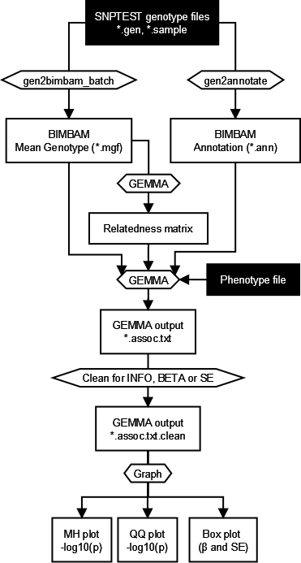

.. |date| date::

==============
GEMMA PIPELINE
==============

:Author: Vince Forgetta
:Contact: <vincenzo.forgetta@mail.mcgill.ca>
:Last modified: |date|

SYNOPSIS
--------

Analyze imputed genotypes using GEMMA. Includes program to convert genotypes from SNPTEST to BIMBAM. The pipeline uses Grid Engine to parallelize computation.

REQUIREMENTS
------------
* Linux
* Grid Engine
* Python with the multiprocessing module.
* Perl
* R statistical package with gap library.

PIPELINE STEPS
--------------

This section describes how to execute the GEMMA pipeline. For a detailed description of the input files required for the pipeline, see the next section (INPUT FILES).

A flow diagram illustrating the pipeline is depicted below:

The required input files are in black background. Intermediate result files are boxed and programs are within pointed boxes.

Once the input files are ready (see INPUT FILES section of this document), you can proceed to execute steps in the pipeline.

STEP 1: Convert Genotypes from SNPTEST to BIMBAM
~~~~~~~~~~~~~~~~~~~~~~~~~~~~~~~~~~~~~~~~~~~~~~~~

.. important:: For a particular genotype data set, this should be COMPUTED ONLY ONCE.

For more detail see Supplementary section S1.

STEP 2: Compute Relatedness Matrix
~~~~~~~~~~~~~~~~~~~~~~~~~~~~~~~~~~

.. important:: For a particular genotype data set, this should be COMPUTED ONLY ONCE.

For more detail see Supplementary section S2.

STEP 3: SNP filter file
~~~~~~~~~~~~~~~~~~~~~~~

.. important:: Typically this file contains a list of SNPs that that exceed informativity of 0.4 as calculated from IMPUTE2. For a particular genotype data set, it should be COMPUTED ONLY ONCE. However, SNPs can be included in this file for any other reason (e.g. coding SNPs), thus it may be required to generate for specific circumstances.

This file is used to filter SNPs, e.g. filter by SNP informativity as calculated from IMPUTE 2. This input file is optional. It is used to filter SNPs from the GEMMA results. Ommitting it will just skipthis part of the filtering step in the pipeline. 

An excerpt from the SNP filter file::

chr10:100001116
chr10:10000260
chr10:100002710
chr10:100003211
chr10:10000325
chr10:10000374
chr10:100004514
chr10:100005596

Where each line is a single SNP name.

For further details on how to generate a SNP Filter file from IMPUTE2 informativity values see section S3.

STEP 4: Prepare the phenotype file
~~~~~~~~~~~~~~~~~~~~~~~~~~~~~~~~~~

A phenotype file consists of one value per line for every individual::

 phenotype_value1
 phenotype_value2
 phenotype_value3
 phenotype_value4
 ...
 phenotype_valueN

.. important:: The order of the individuals MUST be the same as they occur in the genotype file and relatedness matrix.  If converting genpotype data from IMPUTE2 (see section S1 of this document), the sample order is specifies in the IMPUTE2 \*.sample files.

More than one row can be present, indicating multiple phenotype values per individual. Covariates can also be given in a separate file.

Please refer to the GEMMA manual for more detail on how to create a phenotype and covariate file.

You can then specify which phenotype to use or the covariate file using the "-g" option of the pipeline (see STEP 5 of the pipeline below).

Also, to convert a GenABEL formatted phenotype file to GEMMA format you can use the following script::

 bin/genabelPheno2gemmaPheno.py 

See the contents of this script for further details.

STEP 5: Run GEMMA pipeline
~~~~~~~~~~~~~~~~~~~~~~~~~~

The pipeline should be executed from within a directory to store results. For example::

 mkdir -p ~/gemma_results/
 cd ~/gemma_results/

Once you are in the output directory, and have all the required files (\*.mgf.gz (BIMBAM Genotype), \*.ann (BIMBAM Annotation), phenotype, and relatedness matrix), the pipeline is run using the run_pipeline script::

 run_pipeline.bash -m ../matrix/317k/merge.bimbam.cXX.txt \
                 -p ../pheno/pheno.txt \
		 -t ~/tempdata/ \
		 -f 
		 -i ~/static/tuk.info_0.4 \
 		 ~/share/t123TUK/imputed/1kGenomes.Phase1/bimbam/*.mgf.gz

Parameters in effect are::

 -m    [filename]    Relatedness matrix file (required)
 -p    [filename]    Phenotype file (required)
 -t    [directory]   Temporary directory (optional, default ~/tempdata/)
 -f                  Apply filters to SNPs.
 -i    [filename]    Use file to filter SNPs (optional, default no filtering)

After all flagged parameners, the path to the BIMBAM mean genotype files is provided. Wildcards are allowed e.g.,::

   ~/share/t123TUK/imputed/1kGenomes.Phase1/bimbam/*.mgf.gz

A complete list of available parameters is::

 Primary options:
 -m    [filename]    Relatedness matrix file (required)
 -p    [filename]    Phenotype file (required)
 -t    [directory]   Temporary directory (optional, default ~/tempdata/)

 GEMMA options:
 -g    [string]      GEMMA options (optional, default "-fa 4")
 -a    [float]       GEMMA minor allele frequency cutoff (default 0.01)
 -n    [float]       GEMMA missigness percent cutoff (default 0.05)

 Output options:
 -o    [string]      Prefix for output files (optional, default "genome")
 -s    [float]       P-value cutoff for top SNPs table (default 5e-06)
 -q    [string]      Grid Engine queue to submit jobs (default all.q)

 Filter options:
 -f                  Apply filters below to plots.
 -i    [filename]    Use file to filter SNPs (optional, default no filtering)
 -e    [float]       Standard error cutoff value (default 0.01)
 -b    [float]       Absolute value of beta cutoff (default 1.5)

The pipeline consists of 4 steps:

i. Run GEMMA for each genotype file (gemma binary). 
ii. Filter SNPs for BETA, SE, informativity, etc (clean.bash).
iii. Generate graphs for filtered results on a per chromosome basis (graphs.bash).
iv. Once all genotype files are processed, summarize results (graphs, top snps table) for the entire dataset (results.bash).

INPUT FILES
-----------

In addition to the information below, further details can also be obtained from the GEMMA manual.

The following files are required by the pipeline:

Phenotype File
~~~~~~~~~~~~~~

A phenotype file consists of one value per line for every individual::

 phenotype value1
 phenotype value2
 phenotype value3
 phenotype value4
 ...
 phenotype valueN

.. important:: The order of the individuals MUST be the same as they occur in the genotype file and relatedness matrix.  If converting genpotype data from IMPUTE2 (see section S1 of this document), the sample order is specifies in the IMPUTE2 \*.sample files.

More than one row can be present, indicating multiple phenotype values per individual. Covariates can also be given in a separate file.

Please refer to the GEMMA manual for more detail on how to create a phenotype and covariate file.

You can then specify which phenotype to use or the covariate file using the "-g" option of the pipeline (see STEP 4 of the pipeline below).

Also, to convert a GenABEL formatted phenotype file to GEMMA format you can use the following script::

 bin/genabelPheno2gemmaPheno.py 

See the contents of this script for further details.

SNP Genotype files
~~~~~~~~~~~~~~~~~~

The pipeline accepts as input genotype data in SNPTEST or IMPUTE format (i.e, \*.gen.gz files). See the http://www.stats.ox.ac.uk/~marchini/software/gwas/file_format.html for further information regarding this file format.

SNP Filter File (optional)
~~~~~~~~~~~~~~~~~~~~~~~~~~

This file is used to filter SNPs, e.g. filter by SNP informativity. This input file is optional. It is used to filter SNPs from the GEMMA results. Omitting it will just skip this step. 

An excerpt from the SNP filter file::

 10-100000625 10 100000625
 10-100000645 10 100000645
 10-100001867 10 100001867
 10-100003242 10 100003242
 10-100003302 10 100003302
 10-100003304 10 100003304
 10-100003785 10 100003785
 10-100004360 10 100004360

Where columns are <snp_name> <chrom> <pos>.

To filter SNPs for informativity from IMPUTE2 use the info.bash script. By default, minimum informativity cutoff is set to 0.4::

 info.bash <path_to_info_files> > genome_0.4.info

As input, this script accepts one or more SNP-wise information files (e.g. from 317k and 610k). It uses the value of the fifth column (**info**) to filter SNPs.

.. important:: When multiple info values exist for a given SNP (e.g. a common SNP from 317k and 610k datasets), the SNP is retained only if it passes cutoff in all datasets. This can be changed by altering the parameters used by the uniq command within the info.bash script.

To alter the minimum informativity cutoff, change the INFO_MIN_FREQ variable within the info.bash script.

Also, change TMPDIR to a location with sufficient disk space on your system.

PROGRAMS
--------

The programs within the bin directory and their purpose are:

Data preparation
~~~~~~~~~~~~~~~~

* gen2bimbam_batch.bash -- Script to batch convert using Grid Engine one or more SNPTEST files to BIMBAM mean genotype format. Uses gen2bimbam.bash.
* gen2bimbam.bash -- Wrapper script to convert one SNPTEST file to BIMBAM mean genotype format. Uses gen2bimbam.py.
* gen2bimbam.py -- Script to convert one SNPTEST file to BIMBAM mean genotype format.
* gen2annotate.bash -- Generate a BIMBAM SNP information file from SNPTEST genotype file.
* genabelPheno2gemmaPheno.py -- Script to convert GenABEL phenotype file to GEMMA phenotype file.
* info.bash -- Create SNP informativity file.

Data Analysis
~~~~~~~~~~~~~

* run_pipeline.bash -- Script to execute the GEMMA analysis pipeline. This script executes the following programs:

 - gemma -- The GEMMA binary.
 - clean.bash -- Filter SNP results from GEMMA (\*.assoc.txt) for INFO, BETA, and SE.
 - graphs.bash -- Script to generate graphs (MH plot, QQ plot) from GEMMA results (\*.assoc.txt) for each input genotype file.
 - manhattan.r -- R code to generate a manhattanplot. Used by graphs.bash.
 - results.bash -- Script to MERGE all GEMMA results (\*.assoc.txt) and generate graphs.

4. OUTPUT FILES
---------------

Summary results of the GEMMA analysis are:

Association results
~~~~~~~~~~~~~~~~~~~

Within the GEMMA output/ directory there are \*.assoc.txt and \*.assoc.txt.clean files, containg GEMMA results for all SNPs and filtered SNPs, respectively.

.. important:: If the "-f" option is provided to the pipeline, SNPs in the "clean" files are filtered for informativity as well as beta and SE. The cutoff values for these parameters can be specified when running the pipeline (-b for BETA and -e for SE), or by supplying a SNP Filter files (see INPUT FILES section of this document).

Manhattan plot
~~~~~~~~~~~~~~

A Manhattan plot is generated for each genotype file as well as for the entire dataset.

.. image:: doc/mhtplot_results.png
   :width: 50 %
   :alt: A Manhattan plot

QQ-plot
:::::::

A QQ plot is generated for each genotype file as well as for the entire dataset.

.. image:: doc/qqplot_results.png
   :width: 50 %
   :alt: A QQ plot.

Box plots
:::::::::

Box plots for Beta and SE are generated for each genotype file as well as for the entire dataset.

.. image:: doc/boxplots_results.png
   :width: 50 %
   :alt: A boxplot.

Top SNPs table
::::::::::::::

The association results file filtered for SNPs with p-value <= 5e-06::

 chr     rs      ps      n_miss  beta    se      l_remle l_mle   p_wald  p_lrt   p_score
 1 1-74380277 74380277 0 -4.691591e-01 1.006133e-01 9.642427e-01 9.680234e-01 3.245198e-06 3.216472e-06 3.479304e-06
 1 1-74407171 74407171 0 -4.890655e-01 1.030370e-01 9.680546e-01 9.717733e-01 2.161249e-06 2.141216e-06 2.329294e-06
 1 1-118178100 118178100 0 1.164373e-01 2.445510e-02 9.480294e-01 9.520880e-01 2.010044e-06 1.997045e-06 2.178404e-06
 1 1-118178654 118178654 0 1.157201e-01 2.452723e-02 9.451781e-01 9.492383e-01 2.484445e-06 2.470947e-06 2.689299e-06
 1 1-118179969 118179969 0 1.112107e-01 2.374274e-02 9.531481e-01 9.571918e-01 2.931735e-06 2.909885e-06 3.154640e-06
 2 2-50816899 50816899 0 2.354443e-01 5.117126e-02 9.045662e-01 9.085561e-01 4.367353e-06 4.457731e-06 4.925201e-06
 2 2-67822643 67822643 0 1.196912e-01 2.592793e-02 9.863677e-01 9.902034e-01 4.061467e-06 4.034836e-06 4.365852e-06
 2 2-67823472 67823472 0 1.191423e-01 2.596089e-02 9.852127e-01 9.890426e-01 4.620003e-06 4.588881e-06 4.955312e-06
 2 2-67826230 67826230 0 1.200316e-01 2.587550e-02 9.853001e-01 9.891376e-01 3.646014e-06 3.620871e-06 3.922294e-06

SUPPLEMENTARY INFORMATION
-------------------------

S1: Convert IMPUTE2 to BIMBAM Mean Genotype Format
~~~~~~~~~~~~~~~~~~~~~~~~~~~~~~~~~~~~~~~~~~~~~~~~~~

STEP1: Convert Genotypes from SNPTEST to BIMBAM
:::::::::::::::::::::::::::::::::::::::::::::::

GEMMA is compatible with BIMBAM mean genotype file format. Genotype data is in SNPTEST or IMPUTE format (i.e., \*.gen.gz files) is convert to BIMBAM format using the following script::

 bin/gen2bimbam_batch.bash ~/archive/t123TUK/imputed/1kGenomes.Phase1/gen.sample/chr/\*.gen.gz

Compress the genotype files using gzip.

The output mean genotype files are given a ".mgf.gz" file extension.

STEP2: Generate BIMBAM SNP Annoation File
:::::::::::::::::::::::::::::::::::::::::

Files containing SNP information, such as rs number, chromosome,  and position, can be optionally supplied to the pipeline. To generate them use the following script to convert SNP information from the SNPTEST genotype files::

 bin/gen2annotate.bash ~/archive/t123TUK/imputed/1kGenomes.Phase1/gen.sample/chr/*.gen.gz

This script assumes the chromosome number is present in the file name in the format chr1.gen, or 1.gen.

The output SNP annotation files are given a ".ann" file extension.

S2: Compute relatedness matrix
~~~~~~~~~~~~~~~~~~~~~~~~~~~~~~

In addition to a genotype and phenotype data, GEMMA also a relatedness matrix. To generate a relatedness matrix for all the genotype data

Merge all BIMBAM genotype data into one file
::::::::::::::::::::::::::::::::::::::::::::

::
 
  cat <path_to_mgf_files>/\*.mgf > merge.mgf

Create a fake phenotype file
::::::::::::::::::::::::::::

GEMMA computes a relatedness matrix ONLY for samples with a phenotype. As a result, genotype data would be excluded for for datasets containing samples with missing phenotype values. This can be overcome by generating a fake phenotype file. For example, a dataset with 2500 samples, we can generate a fake phenotype file (phenotype values of 1 for all samples) like so::

  NUM_SAMPLES=2500
  for i in $(seq 1 $NUM_SAMPLES); do echo 1; done > pheno.txt

Create relatedness matrix
:::::::::::::::::::::::::

The relatedness matrix is calcuated using GEMMA. GEMMA provides two estimates of the relatedness matrix, centred and standardized (see GEMMA manual for more info).  The rational for choosing which to use is detailed in the following correspondence with the author of GEMMA, Xiang Zhou::

 GEMMA provides two options to calculate the relatedness matrix, and which one to prefer will largely depend on the underlying genetic architecture of the given trait. Specifically, if SNPs with lower minor allele frequency tend to have larger effects (which is inversely proportional to its genotype variance), then the standardized genotype matrix is preferred. If the SNP effect size does not depend on its minor allele frequency, then the centered genotype matrix is preferred. Of course, one typically does not know which case is more close to the truth. In our previous experience (based only on about a dozen traits), we typically find the centered genotype matrix provide better control for the population structure in lower organisms, and the two matrices seem to perform similarly in humans. 

To calculate a centrered relatedness matrix using the merged genotype files and fake phenotype file generated above::

  gemma -g merge.mgf -p pheno.txt -gk 1 -o merge

The matrix will take some time to compute. For example, for a dataset of ~2500 individuals and 36 million SNPs, the relatedness matrix took ~4 days to compute.

S3: Generate SNP Filter file
~~~~~~~~~~~~~~~~~~~~~~~~~~~~

To filter SNPs for informativity from IMPUTE2 use the info.bash script. By default, minimum informativity cutoff is set to 0.4::

 info.bash <path_to_info_files> > genome_0.4.info

As input, this script accepts one or more SNP-wise information files from IMPUTE2 (e.g. from 317k and 610k). It uses the value of the fifth column (**info**) to filter SNPs.

.. important:: When multiple info values exist for a given SNP (e.g. a SNP present in the 317k AND 610k datasets), the SNP is retained only if it passes cutoff in all datasets. This can be changed by altering the parameters used by the uniq command within the info.bash script.

To alter the minimum informativity cutoff, change the INFO_MIN_FREQ variable within the info.bash script.

Also, change TMPDIR to a location with sufficient disk space on your system.
