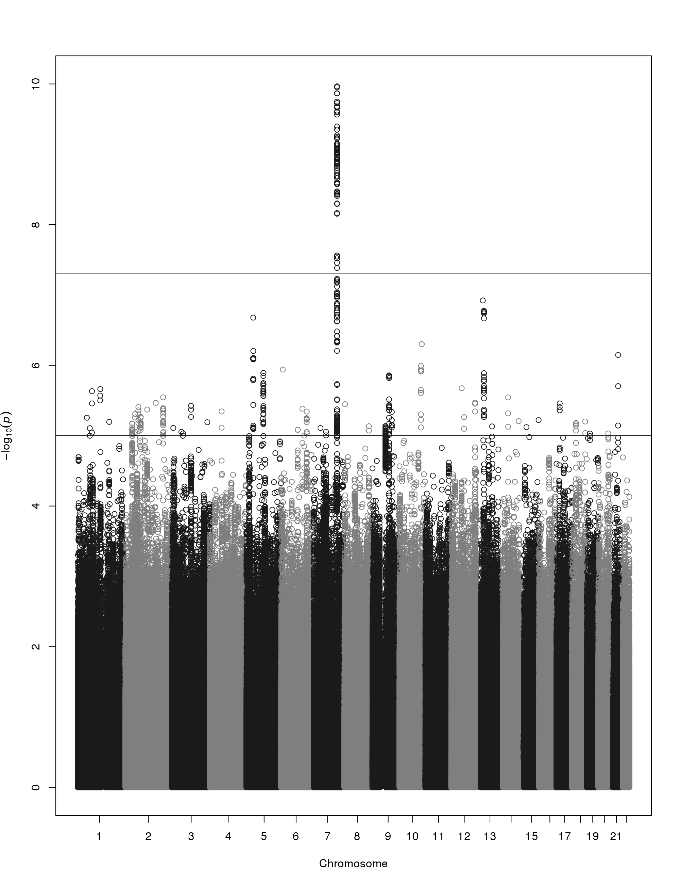
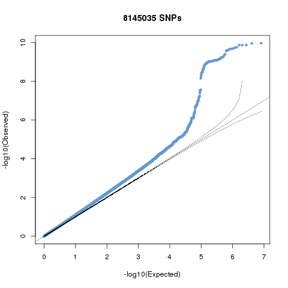
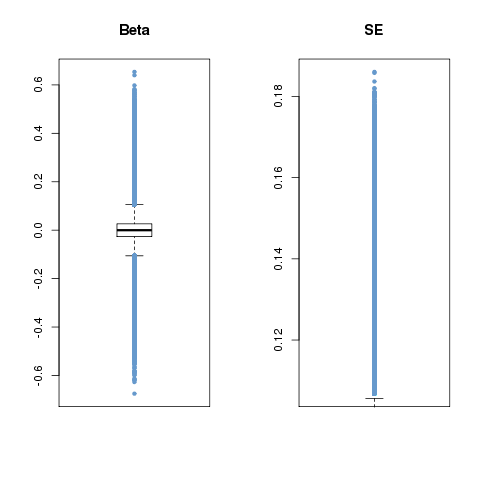

.. |date| date::

==============
GEMMA PIPELINE
==============

:Author: Vince Forgetta
:Contact: <vincenzo.forgetta@mail.mcgill.ca>
:Last modified: |date|

SYNOPSIS
--------

Analyze imputed genotypes using GEMMA.

Methods to convert genotypes from SNPTEST are made available for use.

The pipeline uses Grid Engine to parallelize computation.

ISSUES
------
* GEMMA require a phenotype file to calculate relatedness matrix. Does this mean it needs to be recalculated for each phenotype?

REQUIREMENTS
------------

* Linux
* Grid Engine
* Python with the multiprocessing module.
* Perl
* R statistical package with gap library.
* Plink, gtool are optional, and used to build initial relatedness matrix.

PIPELINE STEPS
--------------

1. Create a phenotype file
''''''''''''''''''''''''''

Bascically, a phenotype file consists of one value per line for every individual::

 phenotype value1
 phenotype value2
 phenotype value3
 phenotype value4
 ...
 phenotype valueN

More than one row can be present, indicating multiple phenotype values per individual. Covariates can also be given in a separate file.

Please refer to the GEMMA manual for more detail on how to create a phenotype and covariate file.

You can then specify which phenotype to use or the covariate file using the "-g" option of the pipeline (see section 3 below).

Also, to convert a GenABEL formatted phenotype file to GEMMA format you can use::

 bin/genabelPheno2gemmaPheno.py 

See the contents of this script for further details.

2. Genotypes and Relatedness Matrix
'''''''''''''''''''''''''''''''''''

In addition to a phenotype file, GEMMA also requires genotypes in BIMBAM format (see section S1 for converting SNPTest to BIMBAM) and a relatedness matrix (see section S2).

Optionally, pipeline also accepts a list of informative SNPs. See section S3 for how to generate such a file.

3. Run GEMMA pipeline
'''''''''''''''''''''

Because GEMMA does not support naming a target output directory, the pipeline should be executed from the directory to store results. For example::

 mkdir -p ~/share/vince.forgetta/gemma_results/project_1
 cd ~/share/vince.forgetta/gemma_results/project_1

Once you are in the proper directory and have all these required files the pipeline is run using the run_pipeline script::

 run_pipeline.sh -m ../matrix/317k/merge.bimbam.cXX.txt \
                 -p ../pheno/pheno.txt \
		 -t ~/tempdata/ \
		 -i ~/share/vince.forgetta/0712-probabel-pipeline/static/tuk.info_0.4 \
 		 ~/share/vince.forgetta/t123TUK/imputed/1kGenomes.Phase1/bimbam/*.mgf

Where all options are::

 -m    [filename]    Relatedness matrix file (required)
 -p    [filename]    Phenotype file (required)
 -i    [filename]    Informative SNPs file (optional, default no filtering)
 -t    [directory]   Temporary directory (optional, default ~/tempdata/)
 -g    [string]      GEMMA options (optional, default "-fa 4")

After all options the path to the mean genotype files is provided. Wildcards are allowed e.g.,::

   ~/share/vince.forgetta/t123TUK/imputed/1kGenomes.Phase1/bimbam/*.mgf 

will process all mean genotype files for t123TUK imputed genotypes.

The pipeline consists of 4 steps:

i. Run GEMMA for each genotype file (gemma binary). 
ii. Remove SNPs with low informativity, etc (clean.bash).
iii. Generate graphs for each genotype file (graphs.bash).
iv. Once all genotype files are processed, summarize results for the entire dataset (results.bash).

4. Pipeline Output
''''''''''''''''''

Summary results of the GEMMA analysis are:

4.1 Association results
:::::::::::::::::::::::

Within the \"output\" directory there are \*.assoc.txt and \*.assoc.txt.clean files, containg GEMMA results for all SNPs and filtered SNPs, respectively.

.. important:: Informative SNPs in the "clean" files are filtered for informativity (if the option is provided to the pipeline), as well as only retaining SNPs with a beta between -1.5 and 1.5 and SE >= 0.01.

4.2 Manhattan plot
::::::::::::::::::

A Manhattan plot is generated for each genotype file as well as for the entire dataset.

3.3 QQ-plot
:::::::::::

A QQ plot is generated for each genotype file as well as for the entire dataset.

4.4 Box plots
:::::::::::::

Box plots for Beta and SE are generated for each genotype file as well as for the entire dataset.

4.5 Top SNPs table
::::::::::::::::::

The association results file filtered for SNPs with p-value <= 5e-06::

 chr     rs      ps      n_miss  beta    se      l_remle l_mle   p_wald  p_lrt   p_score
 1 1-74380277 74380277 0 -4.691591e-01 1.006133e-01 9.642427e-01 9.680234e-01 3.245198e-06 3.216472e-06 3.479304e-06
 1 1-74407171 74407171 0 -4.890655e-01 1.030370e-01 9.680546e-01 9.717733e-01 2.161249e-06 2.141216e-06 2.329294e-06
 1 1-118178100 118178100 0 1.164373e-01 2.445510e-02 9.480294e-01 9.520880e-01 2.010044e-06 1.997045e-06 2.178404e-06
 1 1-118178654 118178654 0 1.157201e-01 2.452723e-02 9.451781e-01 9.492383e-01 2.484445e-06 2.470947e-06 2.689299e-06
 1 1-118179969 118179969 0 1.112107e-01 2.374274e-02 9.531481e-01 9.571918e-01 2.931735e-06 2.909885e-06 3.154640e-06
 2 2-50816899 50816899 0 2.354443e-01 5.117126e-02 9.045662e-01 9.085561e-01 4.367353e-06 4.457731e-06 4.925201e-06
 2 2-67822643 67822643 0 1.196912e-01 2.592793e-02 9.863677e-01 9.902034e-01 4.061467e-06 4.034836e-06 4.365852e-06
 2 2-67823472 67823472 0 1.191423e-01 2.596089e-02 9.852127e-01 9.890426e-01 4.620003e-06 4.588881e-06 4.955312e-06
 2 2-67826230 67826230 0 1.200316e-01 2.587550e-02 9.853001e-01 9.891376e-01 3.646014e-06 3.620871e-06 3.922294e-06

SUPPLEMENTARY STEPS
-------------------

S1 Convert SNPTEST to BIMBAM format
'''''''''''''''''''''''''''''''''''

To convert SNPTEST to BIMBAM format::

 bin/gen2bimbam_batch.bash ~/archive/t123TUK/imputed/1kGenomes.Phase1/gen.sample/chr/*.gen

Resulting mean genotype files are in::

 ~/share/vince.forgetta/t123TUK/imputed/1kGenomes.Phase1/bimbam/

Generate annotation files for GEMMA::

 bin/bimbam2annotate.bash ~/share/vince.forgetta/t123TUK/imputed/1kGenomes.Phase1/bimbam/*.mgf

S2 Compute relatedness matrix
'''''''''''''''''''''''''''''
Generated by Houfeng Zheng, common genotyped SNPs from 317k and 610k for t123::

 ~/share/tuk317k_allsamples/

For steps below, are in::

 ~/share/vince.forgetta/0812-gemma-pipeline/matrix/317k

I merged all chromosomes into one file using plink::

 plink --merge-list merge_list.txt --noweb --out merge --ped tuk317k_allsamples_chr10.ped \
       --map tuk317k_allsamples_chr10.map --recode --nonfounders

Used gtool to convert to SNPTEST format::

 gtool -P --ped merge.ped --map merge.map  --og merge.gen --os merge.sample

Convert SNPTEST format to BIMBAM format::

 bin/gen2bimbam_batch.bash merge.gen

Generate relatedness matrix using gemma::

 gemma -g matrix/317k/merge.mgf -p pheno/pheno.txt -gk 2 -o merge.317k

Matrix is for this dataset is in::

 ~/share/vince.forgetta/0812-gemma-pipeline/matrix/317k/merge.bimbam.cXX.txt

S3 SNP informativity file
'''''''''''''''''''''''''

To filter for informative SNPs a list of SNPs with informativity >= 0.4 was generated as follows::

 # Files with informativity information
 INFO_FILES=`ls ~/archive/t123TUK/imputed/1kGenomes.Phase1/info/info_posterior_tuk*.b37ph\
 /*.b37ph.chr1-22.ALL_1000G_phase1interim_jun2011_.posterior_sampled_haps_imputation.impute2_info`
 
 # Min. allele freq to include SNP from informativity files
 INFO_MIN_FREQ=0.4
 
 # Where informative SNPs are stored
 INFO_SNP_FILE=~/share/vince.forgetta/0712-probabel-pipeline/static/tuk.info_${INFO_MIN_FREQ}

 tail -q -n +2 $INFO_FILES | awk "{ if (\$5 >= ${INFO_MIN_FREQ}){ if (\$1 ~ /\-\-\-/){ split(\$2, a, \"-\"); \
 print \$2, a[1], \$3 }else{ print \$2, \$1, \$3 }}}" | sort -k1,1 -T ${TMPDIR} | uniq -d > ${INFO_SNP_FILE}

